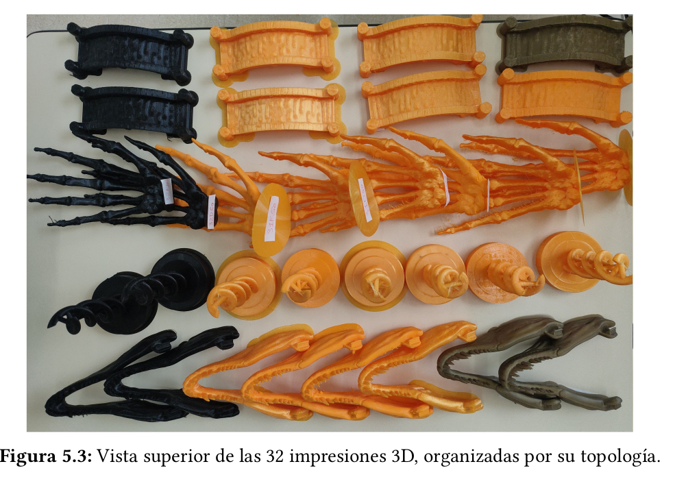
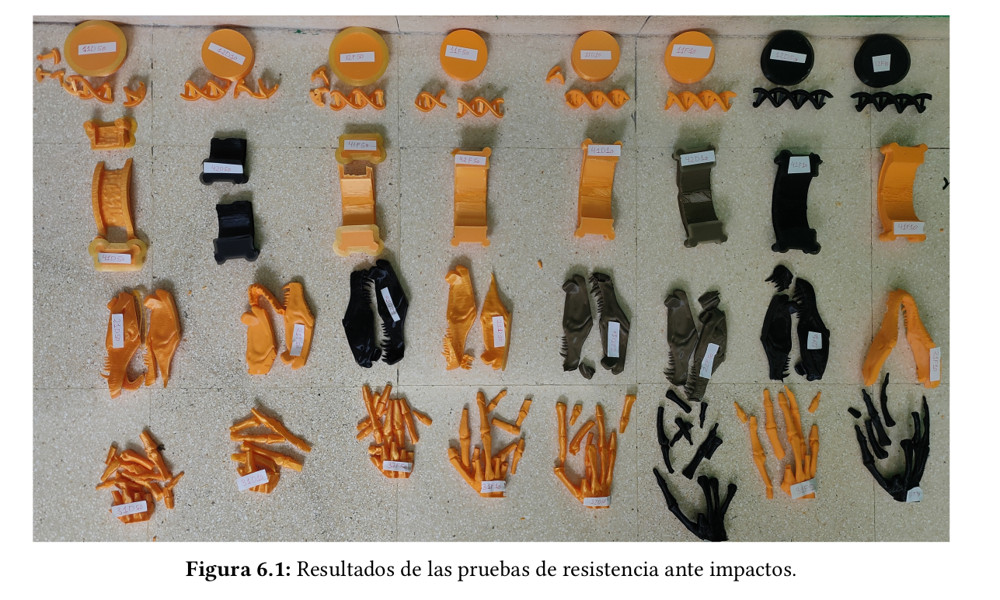
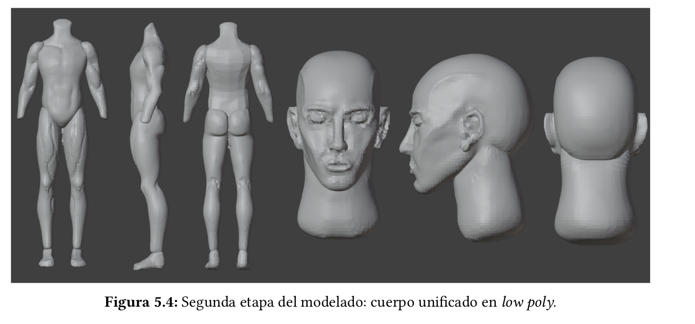
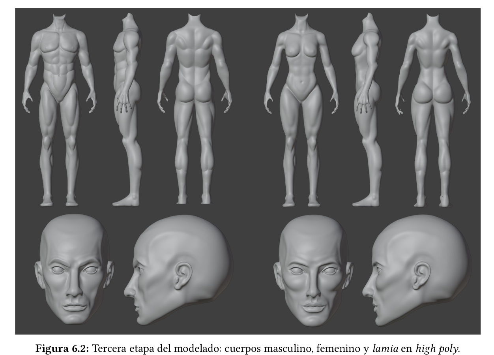
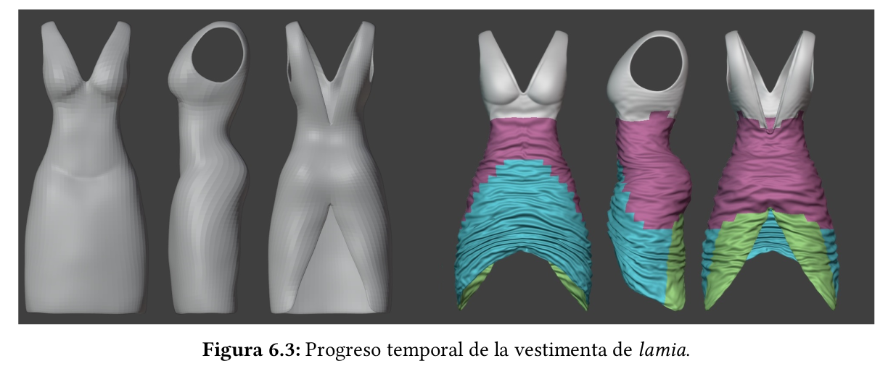
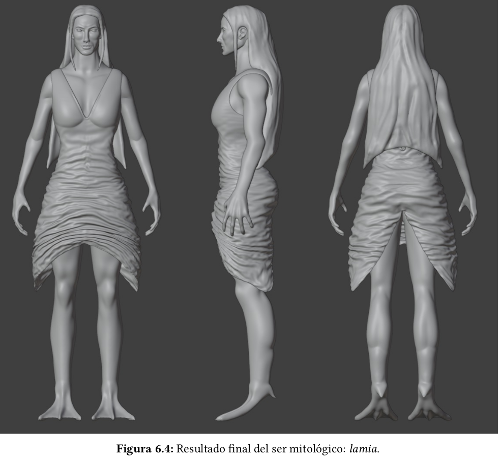

# Accesibilidad y autonomía en el aprendizaje 🧩  
### Estudio del proceso de manufactura en 3D adaptado al alumnado con capacidad visual reducida

**Autora:** Lorena Bocos Olabarría  
**Fecha:** Septiembre 2025  
**Tutorizado por:** Iñigo López Gazpio & Elsa Fernández Gómez de Segura  

---

## 🧠 Descripción

Este proyecto forma parte del **Trabajo de Fin de Grado en Ingeniería Informática** y tiene como objetivo **mejorar la accesibilidad y autonomía en el aprendizaje mediante el uso de tecnologías de modelado e impresión 3D**.  

En colaboración con el **servicio de apoyo IBT-CRI Donostia**, se ha desarrollado un estudio de diseño, manufactura y evaluación de **piezas tridimensionales adaptadas al alumnado con capacidad visual reducida o ceguera**, con el fin de facilitar su comprensión y aprendizaje táctil en el aula.  

El trabajo combina un enfoque **educativo, ingenieril y artístico**, integrando prácticas de optimización de impresión 3D con el diseño de **recursos educativos inclusivos y sostenibles**, incluyendo modelos anatómicos y figuras inspiradas en la **mitología vasca**.

---

## 🎯 Objetivos del proyecto

- Promover la **inclusión educativa** mediante el uso de tecnologías tridimensionales.  
- Diseñar y fabricar **material didáctico táctil** adaptado a estudiantes con baja visión.  
- **Optimizar los parámetros de impresión 3D** para mejorar la resistencia y reducir el consumo de material.  
- Desarrollar un **repositorio 3D open source** de recursos educativos reutilizables.  
- Fomentar la **autonomía, accesibilidad y sostenibilidad** en el aprendizaje.

---

## 🧩 Tecnologías utilizadas

- **Blender** – Modelado 3D de las piezas y figuras.  
- **UltiMaker Cura** – Configuración y optimización de impresiones.  
- **Impresoras 3D FDM (PLA)** – Manufactura de modelos físicos.  
- **Python / Excel** – Análisis estadístico de pruebas de impacto y resistencia.  
- **GitHub / Google Drive** – Gestión de versiones y repositorio compartido.  

---

## 🧱 Resultados y aportaciones

- Creación de **más de 30 modelos 3D educativos** adaptados a distintos niveles (Infantil a Bachillerato).  
- Evaluación de **14 patrones de relleno** y distintas densidades de impresión para identificar las configuraciones más resistentes.  
- Construcción de un **repositorio de acceso abierto (CC BY)** que recopila las piezas diseñadas y los resultados experimentales.  
- Colaboración directa con el **servicio IBT-CRI Donostia**, que recibirá las piezas impresas para su uso en el aula.  

---

## 🔬 Ejemplos de piezas diseñadas

- Modelos anatómicos **low poly** y **high poly** (masculino, femenino y “lamia” mitológica).  
- Figuras **didácticas táctiles** para ciencias y biología.  
- Prototipos educativos adaptados a la **educación inclusiva STEAM**.

---

## 📊 Optimización de impresión

Las pruebas experimentales determinaron que la **mejor configuración** para equilibrio entre resistencia y sostenibilidad fue:  
- **Relleno tipo “grid” o “cross” al 10% de densidad**,  
- **Grosor de capa de 0.1 mm**,  
- **Filamento PLA estándar**,  
- **Patrón de relleno bidimensional**, con excelente relación resistencia-peso.  

---

## 📸 Capturas y modelos
Todos los modelos generados en este proyecto están disponibles [aquí](https://drive.google.com/file/d/1v5OBTtKRCcz6DovRZ3YLh0b1-Ir5zWlR/view?usp=sharing)

---

## 🌍 Repositorio abierto

Los modelos 3D diseñados en este trabajo están disponibles bajo licencia **Creative Commons Attribution (CC BY)**.  
👉 [Acceder al repositorio de modelos 3D](https://github.com/usuario/repositorio-3D)

---

## 🧾 Conclusiones

El proyecto demuestra el **potencial transformador de la impresión 3D en la educación inclusiva**, al facilitar materiales táctiles adaptados y sostenibles.  
Además, contribuye a los **Objetivos de Desarrollo Sostenible (ODS 4 y 12)**, promoviendo una educación de calidad y una producción responsable.  

A futuro, se prevé la ampliación del repositorio y el desarrollo de nuevas piezas con materiales ecológicos y configuraciones optimizadas.

---

## 📚 Licencia

Este proyecto se distribuye bajo licencia **Creative Commons Attribution (CC BY)**.  
© 2025 Lorena Bocos Olabarría. Todos los derechos reservados.
